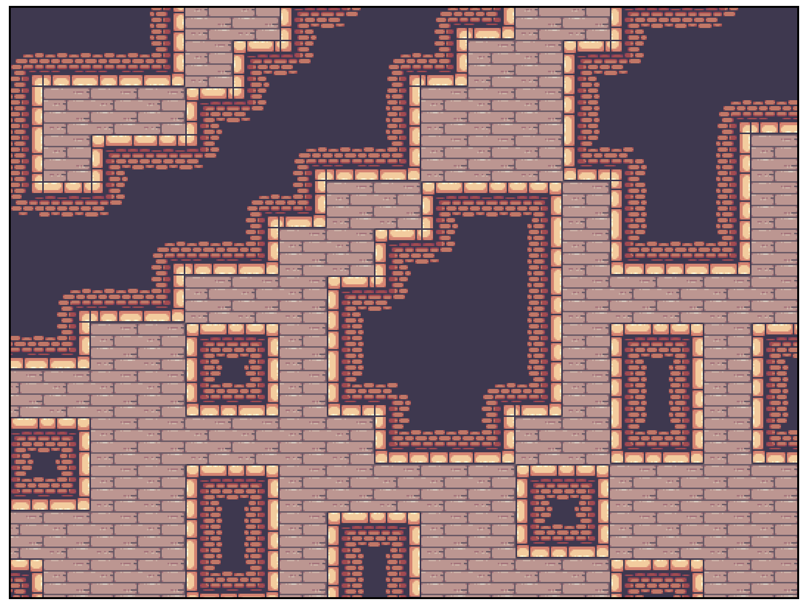

<a id="top"></a>
# 🌆 WFC2D-Multiplayer techdemo
[](https://opensource.org/licenses/MIT)


## 📜Purpose
The WFC2D Multiplayer Techdemo project is an exam project developed for the study of procedural map generation using the [Wave Function Collapse](https://github.com/mxgmn/WaveFunctionCollapse) and the implementation of WebSocket technology to support online multiplayer gameplay.

## 🧾Requirements
Before getting started, make sure you meet the following requirements:
- Node.js
- npm (Node Package Manager)
  
You can follow [this guide](https://nodejs.dev/en/learn/how-to-install-nodejs/) to install them

## 💻Installation
Follow these steps to install the project:

1. Clone the repository:
   ```shell
   git clone https://github.com/AndreaMoschetto/wfc2d-multiplayer-techdemo.git
   ```

2. Navigate to the project directory:
   ```shell
   cd wfc2d-multiplayer-techdemo
   ```

3. Run the following command to install dependencies:
   ```shell
   npm install
   ```

## 🕹️Usage
To run the project on your local machine, follow these steps:

1. Ensure you are in the project directory.

2. Run the following command to build the client and start the server:
   ```shell
   npm start
   ```

3. Open your web browser and go to `http://localhost:7777` to start playing.

## ⚙️Configuration

**The project is ready to run and fully configured, you can ignore this section if you want to try imediatelly this techdemo**,
 but you can customize its behavior. You can modify the configuration settings by editing the `configs.yml` file.

##### Configuration options
###### General
- `users`: The maximum number of users
- `users_per_room`: The maximum number of users per room
- `rooms`: The maximum number of rooms
- `tile_width`: The width of the tile*
- `tile_height`: The height of the tile*
###### Logging

- `rooms_log`: Set to `true` to enable detailed room logging for debugging.

**We're gonna talk about these tile resolution settings in the next subsection*

#### Tilemap Customization
Yes, if you want you can customize the design of the map generated by the WFC algorithm.
The things you've to do are below:
- Put your favourite tilemap in the main folder of the project calling it `tilemap.png`, like the default one
- Set the `tile_width` and `tile_height` configurations matching your tiles resolution
- Adjust the `adjacency_roles.json` file matching your tile's adjacency roles
  
#### How does andacency roles work?
It's easier than it looks:
Every tile has an **id** representing its coordinates in the `tilemap.png` file:
**id: 1_2** means that it is positioned in the 3rd column of the 2nd row.

The `adjacency_roles.json` file contains a dictionary where: 
**keys**: are the **id** of each tile;
**values** are composed like so:
- `adjacency`: a list of 4 sublists, one for each direction
  up, right, down, left (in this order).
  Every direction sublist contains all the ids of the tiles which are allowed to be connected on that side of the entry tile
- `solid`: a boolean flag, if a tile is solid it's not walkable (it's a wall)
  
that's it! 😉


Feel free to adjust these settings to try different configurations, increase room limits or load your tileset. Make sure to save your changes before restarting the project.

## 🙋‍♂️Contributions
If you wish to contribute to this project, you can follow these steps:

1. Fork the repository on GitHub.

2. Clone your fork to your local machine.

3. Create a branch for your contribution:
   ```shell
   git checkout -b your-branch-name
   ```

4. Make the necessary changes and work.

5. Commit your changes:
   ```shell
   git commit -m "Description of your contribution"
   ```

6. Push your changes to your fork:
   ```shell
   git push origin your-branch-name
   ```

7. Create a Pull Request on the original repository.

## 🎫License
This project is licensed under the MIT - see the [LICENSE](LICENSE) file for details
or click the badge [on top of the page](#top) 

##### 🙇‍♂️Attributions
Thanks to [Pixel Frog](https://pixelfrog-assets.itch.io) for creating Sensational assets